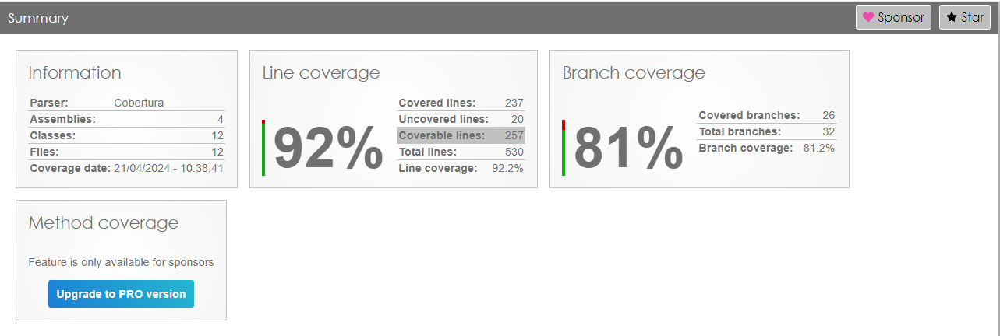

# Documentação de SAGA no Serviço de Pedido - Fase 5

## Introdução

O **nuget-fiap-app-pedido** é um serviço responsável pela gestão de pedidos, utilizando uma arquitetura baseada em microserviços. A aplicação utiliza o padrão SAGA para garantir a consistência dos dados em operações distribuídas, além de mensageria para comunicação entre serviços.

## SAGA

O padrão SAGA é utilizado para gerenciar transações distribuídas. No contexto do serviço de pedidos, o fluxo de SAGA pode ser descrito da seguinte forma:
1. **Início da SAGA**: Um novo pedido é criado.
2. **Processamento**: Cada etapa do pedido (criação, pagamento, preparação) é tratada como uma transação local.
3. **Compensação**: Em caso de falha em qualquer etapa, transações compensatórias são executadas para desfazer as ações anteriores.

## Mensageria

A comunicação entre serviços é realizada através de eventos assíncronos utilizando um sistema de mensageria. As principais mensagens envolvem:
- **Pedido Criado**: Notifica os serviços de pagamento e estoque.
- **Pagamento Realizado**: Informa o serviço de produção para iniciar a preparação.
- **Pedido Concluído**: Atualiza o status do pedido e notifica o cliente.

## Subindo o RabbitMQ para Rodar o Pedido-Service

Para rodar o serviço de pedidos localmente, é necessário ter o RabbitMQ em execução. Siga os passos abaixo para subir o RabbitMQ utilizando Docker:

1. **Instale o Docker**: Caso ainda não tenha, instale o Docker seguindo as instruções no [site oficial](https://www.docker.com/get-started).

2. **Execute o RabbitMQ**:
   ```bash
   docker run -it --rm --name rabbitmq -p 5672:5672 -p 15672:15672 rabbitmq:3.12-management
   ```
2. **Acesse o Management Console:** Abra o navegador e vá para http://localhost:15672.
Use as credenciais padrão (username: guest, password: guest).
4. **Verifique a Conexão:** Certifique-se de que o serviço de pedidos está configurado para se conectar ao RabbitMQ na porta 5672.

## Fluxo do Pedido

1. **Recepção do Pedido**: Cliente envia pedido via API.
2. **Validação e Criação**: Pedido é validado e criado.
3. **Emissão de Eventos**: Mensagens são enviadas para os serviços envolvidos (pagamento, estoque, produção).
4. **Processamento Assíncrono**: Cada serviço processa a mensagem e executa sua respectiva tarefa.
5. **Compensação (se necessário)**: Em caso de erro, mensagens compensatórias são enviadas para desfazer as operações.

## Conclusão

O uso do padrão SAGA e mensageria garante a consistência dos dados e a resiliência do sistema, permitindo que falhas sejam tratadas de forma isolada e compensadas adequadamente.

Para mais detalhes, acesse o [repositório do nuget-fiap-app-pedido](https://github.com/ChristianS0ares/nuget-fiap-app-pedido).


# NuGet FIAP - App Pedido

Este repositório contém a implementação do sistema de gestão de pedidos, parte do projeto da fase IV do curso de pós-graduação em arquitetura de software da FIAP - 3SOAT. O sistema é estruturado em várias camadas, incluindo acesso a dados, lógica de negócios, e uma API para acesso via aplicativos ou serviços externos.


## Membros:
- [Camila Lemos de Melo - RM 352359]()
- [Christian Soares Santos - RM 351509](https://www.linkedin.com/in/christian-soares-93250a170/)
- [Fábio Guimarães Martins - RM 351825](https://www.linkedin.com/in/fabio-martins-2021)
- [Josué Batista Cruz Júnior - RM 352045](https://www.linkedin.com/in/josuejuniorjf/)


## Tecnologias Utilizadas

- ASP.NET Core: Utilizado para construir a API no servidor, gerenciando as requisições e respostas HTTP.
- Swagger/OpenAPI: Utilizado para documentar a API, permitindo uma visualização interativa e design da API através do Swagger UI.
- MongoDB.Driver: Driver permite que aplicativos escritos em linguagens baseadas em .NET acessem e manipulem dados armazenados em instâncias do MongoDB de maneira eficaz e eficiente.
- MongoDB: Banco de dados baseado em documentos.
- Docker: Contêinerização para facilitar o desenvolvimento, teste e produção.
- SpecFlow: Framework para desenvolvimento dirigido por comportamento (BDD), utilizando a linguagem Gherkin para definição de testes.
- XUnit: Framework para testes unitários em .NET.

## Estrutura do Repositório
### Camadas
- nuget-fiap-app-pedido-common: Contém modelos e interfaces utilizados pelos serviços e repositórios.
- nuget-fiap-app-pedido-repository: Implementação do acesso aos dados utilizando o MongoDB.Driver.
- nuget-fiap-app-pedido-server: API que expõe endpoints para interação com o sistema de pedidos.
- nuget-fiap-app-pedido-services: Lógica de negócios, chamando os repositórios para acesso a dados.
### Testes
- nuget-fiap-app-pedido-test: Testes unitários e de integração.
- nuget-fiap-app-pedido-test-bdd: Testes de comportamento usando SpecFlow.

## Docker
O sistema pode ser executado em contêineres Docker, facilitando a configuração e implantação. O arquivo docker-compose.yml raiz configura o ambiente necessário, incluindo a aplicação e o banco de dados.
```bash
docker-compose up -d --build
```
## Testes
Testes são uma parte crucial do projeto, garantindo que todos os componentes funcionem como esperado antes da implantação. O projeto inclui:

- Testes Unitários: Testam componentes individuais para assegurar que executem suas responsabilidades isoladamente.
- Testes de Integração: Verificam a integração entre diferentes módulos e serviços.
- Testes BDD (Behavior-Driven Development): Utilizam cenários escritos em linguagem natural para garantir que o sistema atende aos requisitos de negócios.

### Execução dos Testes
#### Testes Unitários
Para executar apenas os testes unitários na camada server, utilize o seguinte comando:
```bash
dotnet test --filter Category=Unit
```
Este comando seleciona e executa todos os testes marcados com a categoria Unit.
#### Testes de Integração
Para executar os testes de integração:
```bash
dotnet test --filter Category=Integration
```
Antes de rodar os testes de integração, assegure-se de que a base de dados MongoDB esteja configurada corretamente com as variáveis de ambiente DB_PASSWORD, DB_USER, e DB_HOST. Outro requisito é disponibilidade a API de Produtos, como a API de Pedidos realiza a busca dos Produtos nessa API é necessário definir o host.
```bash
set ProdutoApi__BaseUrl=https://api-de-produtos-prod/endereco
```
#### Testes BDD
Para os testes de BDD, utilize:
```bash
dotnet test --filter Category=bdd
```
Da mesma forma que os testes de integração, é necessário configurar a base de dados e as variáveis de ambiente mencionadas anteriormente para garantir que os testes de BDD funcionem corretamente.
### Configuração de Ambiente
É importante que a base de dados esteja acessível e configurada corretamente para os testes de integração e BDD. Configure as seguintes variáveis de ambiente antes de executar os testes:

- DB_PASSWORD: Senha do usuário da base de dados.
- DB_USER: Nome do usuário da base de dados.
- DB_HOST: Host onde a base de dados está rodando.

Essas configurações garantem que os testes possam interagir corretamente com a base de dados, permitindo uma avaliação eficaz da integração e comportamento dos componentes do sistema.

Como já mencionado anteriormente a definição do Host da API de Produtos é essencial:
```bash
set ProdutoApi__BaseUrl=https://api-de-produtos-prod/endereco
```


### Relatório de Cobertura de Testes

Para visualizar o relatório de cobertura de testes, navegue até o diretório `nuget-fiap-app-pedido-test/coveragereport` e abra o arquivo `index.html`. Este relatório fornece uma visão detalhada da cobertura de testes alcançada pelos testes unitários e de integração, ajudando a identificar áreas do código que podem necessitar de mais atenção em termos de testes.




### Geração de Relatório de Cobertura de Testes
Para gerar um relatório detalhado de cobertura de testes, que permite avaliar quais partes do código foram efetivamente testadas, siga os passos abaixo:
#### Executar Testes com Cobertura
Primeiro, execute os testes com a coleta de dados de cobertura ativada usando o seguinte comando:
```bash
dotnet test /p:CollectCoverage=true /p:CoverletOutputFormat=cobertura
```
Este comando habilita a coleta de cobertura durante a execução dos testes e gera um arquivo de cobertura no formato cobertura, um padrão XML para relatórios de cobertura.
#### Gerar Relatório de Cobertura
Após a coleta dos dados de cobertura, utilize o ReportGenerator para converter o arquivo de cobertura em um relatório HTML amigável, facilitando a análise visual dos resultados. Execute o comando abaixo:
```bash
reportgenerator -reports:"coverage.cobertura.xml" -targetdir:"coveragereport" -reporttypes:Html
```
Este comando gera um relatório HTML dentro do diretório coveragereport, utilizando os dados do arquivo coverage.cobertura.xml.
#### Visualizar o Relatório
Para visualizar o relatório de cobertura, navegue até o diretório coveragereport e abra o arquivo index.html em um navegador de sua escolha. Este arquivo apresenta uma visão detalhada da cobertura de teste, incluindo quais linhas de código foram executadas durante os testes.
#### Considerações
Certifique-se de ter o pacote coverlet.collector no seu projeto de teste para a coleta de cobertura funcionar corretamente.
O ReportGenerator deve estar instalado globalmente ou disponível como uma ferramenta em seu ambiente de desenvolvimento para que o comando funcione.


## Consumo da API

Para facilitar o consumo e teste da API, disponibilizamos uma [coleção](api-pedidos.postman_collection.json) do Postman que contém modelos pré-configurados de requisições. Abaixo estão detalhadas as rotas disponíveis, juntamente com exemplos de uso para cada operação.


### Pedidos

#### Listar Todos os Pedidos
- Método: GET
- URL: http://localhost:8082/Pedido
- Descrição: Retorna todos os pedidos cadastrados no sistema.

#### Criar Pedido
- Método: POST
- URL: http://localhost:8082/Pedido
- Body:
```bash
{
  "cliente": {
    "cpf": "123456789-10",
    "nome": "Cristiano Ronaldo",
    "email": "cr7@jogador.com"
  },
  "itens": [
    {
      "id": 1,
      "quantidade": 2
    },
    {
      "id": 2,
      "quantidade": 2
    }
  ]
}
```
- Descrição: Adiciona um novo pedido ao sistema.

#### Obter Pedido por ID
- Método: GET
- URL: http://localhost:8082/Pedido/ff9405ae-6945-4f6b-92d1-1f273c7ce9f8
- Descrição: Retorna o pedido conforme ID passado.

#### Atualizar Pedido
- Método: PUT
- URL: http://localhost:8082/Pedido/ff9405ae-6945-4f6b-92d1-1f273c7ce9f8
- Body:
```bash
{
  "cliente": {
    "cpf": "123456789-10",
    "nome": "Cristiano Ronaldo",
    "email": "cr7@jogador.com"
  },
  "itens": [
    {
      "id": 1,
      "quantidade": 2
    },
    {
      "id": 14,
      "quantidade": 2
    }
  ]
}
```
- Descrição: Atualiza os dados de um pedido existente.

#### Excluir Pedido
- Método: DELETE
- URL: http://localhost:8082/Pedido/ff9405ae-6945-4f6b-92d1-1f273c7ce9f8
- Descrição: Remove um pedido do sistema.
